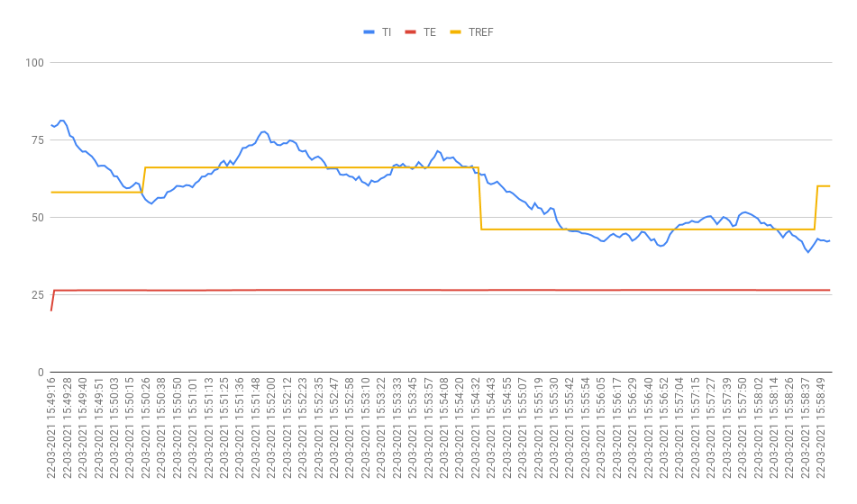
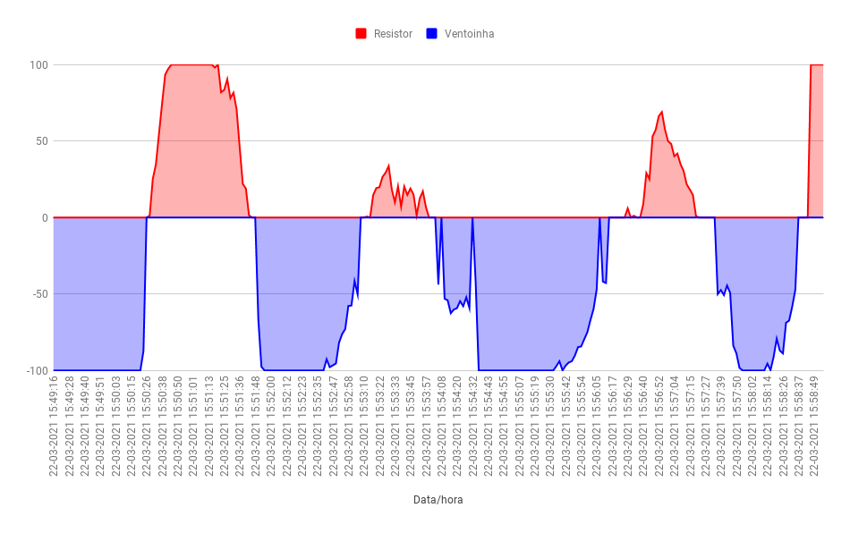
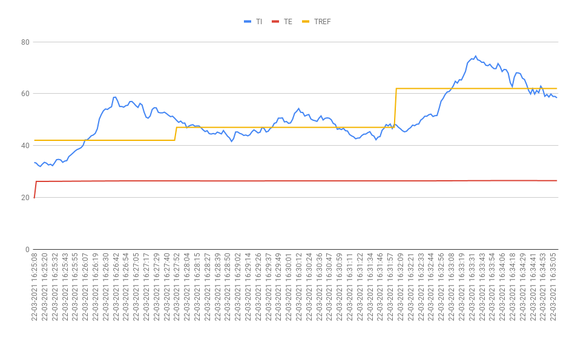
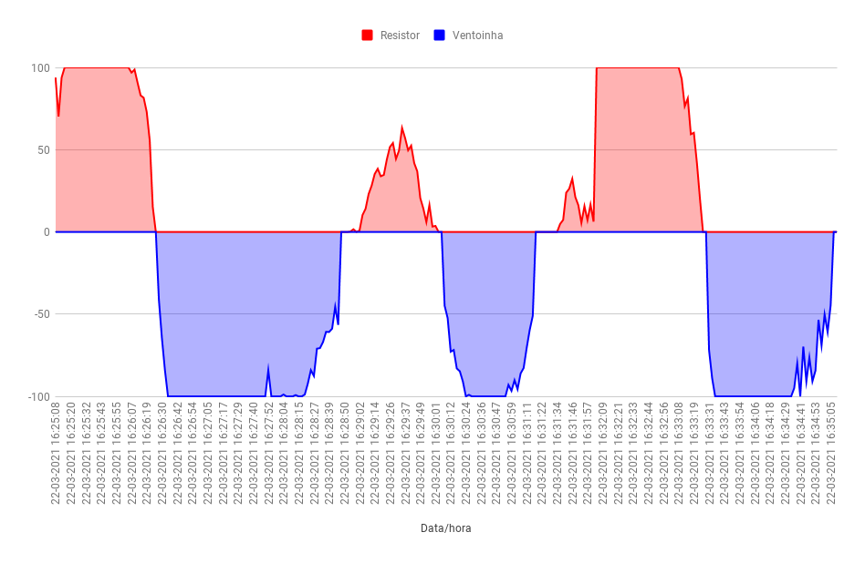

# Projeto 1 - Fundamentos de Sistemas Embarcados

## Dados do Aluno:

* **Nome:** Rômulo Vinícius de Souza
* **Matrícula:** 15/0147601

## Introdução

O projeto 1 da disciplina de Fundamentos de Sistemas Embarcados consiste no controle de temperatura de um sistema sob atuação de dois dispositivos (um resistor de potência e uma ventoinha). O projeto foi desenvolvido e testado em uma Raspeberry Pi, para mais detalhes do experimento: [Projeto 1 - 2020.2](https://gitlab.com/fse_fga/projetos_2020_2/projeto-1-2020.2)

## Dependências Externas

* [WiringPi](http://wiringpi.com/download-and-install/)

## Executando o Projeto

```bash
# Clone o repositório
$ git clone https://github.com/RomuloSouza/FSE

# Vá para o diretório do projeto
$ cd FSE/projeto_1

# Faça o build o projeto
$ make

# Execute
$ make run
```

## Amostragem de Dados do Experimento

### Legenda

* TI - Temperatura Interna
* TE - Temperatura Externa
* TREF - Temperatura Referencial

### Experimento 1

**Gráfico 1:** Temperaturas X Tempo



**Gráfico 2:** Acionamento Resistor/Ventoinha X Tempo




### Experimento 2

**Gráfico 1:** Temperaturas X Tempo



**Gráfico 2:** Acionamento Resistor/Ventoinha X Tempo


